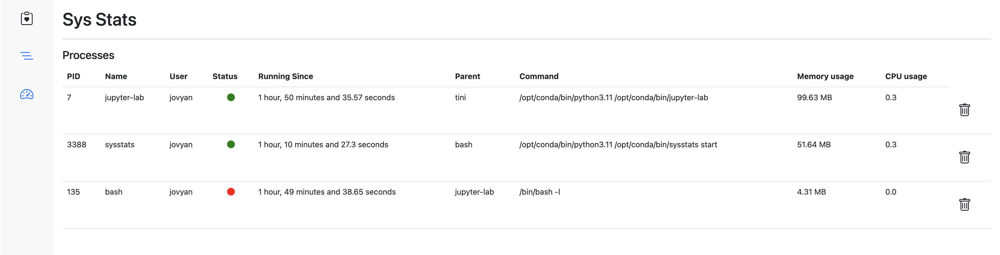
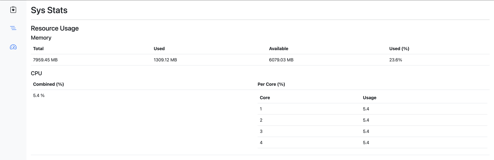
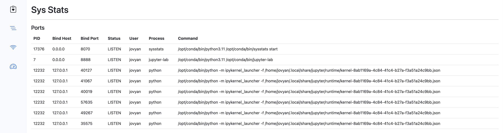

# sys-stats

An open-source Python tool to provide system stats over a web interface.


Project Website: https://amithkoujalgi.github.io/sys-stats/

## Table of Contents

- [Introduction](#introduction)
- [Features](#features)
- [Installation](#installation)
- [Development](#development)

### Introduction

This Python package allows you to monitor various system statistics through a simple web interface. Whether you're a
developer, a sysadmin, or just curious about how your system is performing, this package makes it easy to access and
visualize system metrics.

### Why System Stats Web Interface?

One would definitely question -- "why develop another monitoring tool?"
Well, there are quite a few tools that I have tried but they either needed some effort to setup or lacked one or more
features.

While there are numerous monitoring tools available for different purposes, I needed a solution that was very simple. A
tool that's easy to
install, involves almost no effort to set up, and offers a simple and clean web UI for visualizing essential system
metrics.

PS: I'd appreciate if someone can point me to some good tools that suit the above stated goal! I'd be happy
to take a look at it.

The development of that thought, resulted in a tool that is:

- **Easy To Install:** Install the package using pip and get started with just a few commands.
- **Has a Web Interface:** Access system statistics through a simple, clean and user-friendly web interface.
- **Has Real-Time Monitoring:** Monitor CPU usage, memory usage, disk space, and more in real time.
- **Has Cross-Platform support:** Compatible with various operating systems, including macOS, and Linux.

### Where can I run this?

While it can be run practically on any *nix systems, it's best suited for running on systems that run headless (
server/non-windowed mode) or remotely which need monitoring over the web.
For example:

- you can set it up on docker containers which need to be monitored remotely.
- if you have multiple on-prem servers in a private network that need monitoring at individual host level, you can host
  this tool on each server and access it over web interface.

  The possibilities are endless. The tool will evolve over time to get better.

### Features

- List running processes
- List processes listening on inet ports
- Show hardware metrics - CPU/Memory usage, etc

### Installation

To install the package, use the following pip command:

```bash
pip install sys-stats
```

PyPI project: https://pypi.org/project/sys-stats/

Then run,

```bash
sys-stats start
```

The process starts up with the following logs:

```text
INFO:root:Starting web server on 0.0.0.0:8070
INFO:root:Web UI at: http://0.0.0.0:8070
INFO:     Started server process [21730]
INFO:     Waiting for application startup.
INFO:     Application startup complete.
INFO:     Uvicorn running on http://0.0.0.0:8070 (Press CTRL+C to quit)
```

Now, access the web interface at http://localhost:8070

To specify a different port, run:

```bash
sysstats start --port 8055
```

### Screenshots

Listing processes


Resource utilisation


List of processes listening on inet ports


### Development

#### Requirements

- macOS or Ubuntu or any other *nix distros
- Python 3.8+

#### Building from source

Run:

```bash
bash build.sh
```

This creates a wheel distribution under `dist` directory.

#### Areas of improvement

- Auto-refreshing UI views
- Web-socket enabled comms
- Cache the data in memory to record resource utilisation for a given time period (for 30 mins, or more) - useful for
  plotting resource utilisation graphs.
- Security measures/user authentication
- Searching for processes by PID, process name or command
- UI improvements - look and feel and slickness
- Ability to start the server in background (-d mode)
- Ability to pass an external JSON/YAML configuration file to configure bind address, logging path, etc.
- Support for cluster setup (may be?)

#### Get Involved

Contributions are most welcome!
Whether it's reporting a bug, proposing an enhancement, or helping with code - any sort of contribution is much
appreciated.
Please refer to the contribution guidelines to get started.

### License

The project is released under the MIT License. For more details, consult the [License](./LICENSE) file.


